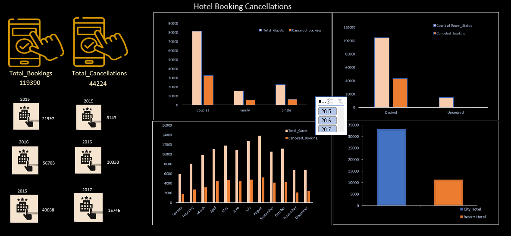

# Hotel Booking Cancellations Dashboard

## Overview

This project presents an in-depth analysis of hotel booking and cancellation trends from 2015 to 2017. Using Microsoft Excel, I created an interactive dashboard that visualizes key metrics such as total bookings, cancellations, seasonal patterns, guest types, and differences between city and resort hotels.

## Objectives

- Understand cancellation trends over three years  
- Analyze the behavior of different customer segments  
- Identify high-cancellation periods and guest types  
- Compare performance between city and resort hotels  

## Tools Used

- Microsoft Excel (Pivot Tables, Charts, Slicers, Conditional Formatting)
- Excel Dashboarding Techniques

## Key Insights

- Total bookings analyzed: **119,390**
- Total cancellations: **44,224** (~37% cancellation rate)
- **Couples** were the most frequent customer type and had the highest cancellations
- Highest cancellations occurred during **summer months**
- **City hotels** experienced more cancellations than resort hotels

## Dashboard Highlights

The Excel dashboard includes:
- Year-wise summary of bookings and cancellations
- Guest type analysis (Couple, Family, Single)
- Monthly trends
- Room preference vs. cancellation behavior
- Comparison between City and Resort Hotels

## Getting Started

1. Download the Excel file from the repository.
2. Use slicers to interact with the dashboard (filter by year, hotel type, etc.).
3. Explore visual trends and data insights.

## Screenshots

